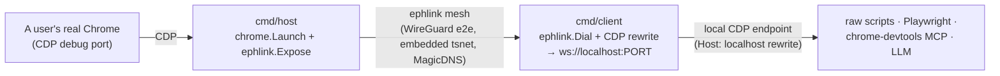

# CLAUDE.md — ephlink

## What this is
**`ephlink`** is a small, protocol-agnostic Go library for ephemeral, authenticated, peer-to-peer links between machines (embedded Tailscale/`tsnet`) — expose a local port from machine A, consume it as a local port on machine B, with single-use auto-expiring credentials. It's the root package of this module.

Its flagship consumer (under `cmd/`) uses it to connect to a **live user's real Chrome over the Chrome DevTools Protocol (CDP)**: passively ingest everything (network/console/events/storage/screencast) AND actively drive it — re-presented as a **local CDP endpoint** so ANY CDP client attaches unchanged (raw scripts, Playwright, the chrome-devtools MCP → an LLM).

## Architecture
Single Go module `github.com/dostarora97/ephlink`: the library is the root package; the binaries live under `cmd/`. CDP is just the library's first consumer.

- **`link.go` / `mint.go`** (root package `ephlink`, CDP-agnostic): the reusable library. Symmetric API — every machine is a `Node` via `Join`; `Expose`/`Dial`/`Serve` are capabilities, not roles. Embedded tsnet transport; ephemeral auto-deregister; `Mint` (OAuth ephemeral keys); `Dial` resolves peer name→tailnet IP via online peers. `Transform` is the only extension point. Its public API mentions nothing about CDP/Chrome/HTTP.
- **`cmd/host`** (ephlink consumer, "host" end): self-contained deletable binary the user runs. Consent gate → launch Chrome (temp profile + `--remote-debugging-port`) → `ephlink.Join` + `Expose`. Quit/Ctrl-C = full teardown (Chrome + profile + ephemeral node). Support pkgs under `internal/chrome`, `internal/consent`.
- **`cmd/client`** (ephlink consumer, "client" end): the operator runs it. `ephlink.Join` + `Dial(peer)` as the reverse-proxy transport + the CDP `Host`/`webSocketDebuggerUrl` rewrite, re-served locally as `ws://localhost:PORT` (+ `/json`, `/json/version`). The generic seam any CDP client attaches to.
- **`cmd/mint`**: thin CLI over `ephlink.Mint`.
- **`docs/`**: `LIBRARY.md` (ephlink reference), `DESIGN.md` (architecture & design decisions), `TAILSCALE-SETUP.md` (one-time tailnet tags/OAuth setup).

## Golden rules for working here
1. **Consult docs before coding.** tsnet: https://tailscale.com/docs/features/tsnet · Tailscale grants/keys API. Use context7 + web search. Bootstrap via canonical CLIs (`go mod init`, `go build`). One module, no `go.work`/`replace`.
2. **Security posture = modern sane defaults, no premature overengineering** . Never `eval` peer-supplied strings; treat inbound CDP as untrusted input. OAuth client secret stays operator-side; nodes get only short-expiry ephemeral keys.
3. **Captures & Tailscale keys are secrets.** `.gitignore` blocks `captures/`, `*.har`, `*.authkey`, `.env`, `.playground/`. Never commit them.
4. **Tailscale config is CDP-agnostic** (part of ephlink's reuse contract): tags are `tag:ephlink-host` / `tag:ephlink-client`; the OAuth client is generic. Hostnames (`cdp-host`, `cdp-client`) are app-specific runtime values, which is fine.
5. **Some hardening is deferred for later** (a live "connected" indicator, binary signing, audit logging, and a provisioning endpoint) — see `docs/DESIGN.md`. These gate broad/untrusted-user distribution.

## .playground/  (gitignored)
`.playground/` is Claude's literal scratch space: run experiments, download things, clone repos, write throwaway scripts, keep notes, stash test data (incl. `ts-oauth.env`, minted keys). **Never committed, safe to delete anytime.** Do messy/experimental work there; keep the tracked tree clean.

## Build / run
Canonical build, quickstarts (loopback + mesh), CLI reference, and releasing live in [`README.md`](README.md). Quick recap: single module — `go build ./...` builds the library + all binaries (or `go build -o host ./cmd/host`, etc.); the loopback path (`host --local-only`) needs no tailnet; the mesh path is `mint` → `host --authkey` → `client --peer` → attach a CDP client.

## Status
Single-module `cmd/` layout; ephlink is the root package with a symmetric API; host + client + mint are its consumers; embedded tsnet + OAuth minting + MagicDNS-by-name proven end-to-end on a real tailnet.
