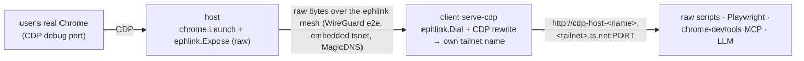

# ephlink

**Ephemeral, authenticated, peer-to-peer links between machines** — a small, protocol-agnostic Go library that moves raw TCP bytes between a local service on one machine and a named peer on another, over a Tailscale mesh (embedded `tsnet`), with single-use auto-expiring credentials. Expose a local port from machine A, consume it as a local port on machine B, and have the link tear itself down when you're done.

```go
import "github.com/dostarora97/ephlink"

node, _ := ephlink.Join(ctx, ephlink.Config{Hostname: "myhost", AuthKey: key})
defer node.Close()                        // ephemeral: auto-deregisters from the mesh
node.Expose("127.0.0.1:9222", 9222)       // publish a local service on the mesh
conn, _ := node.Dial(ctx, "peer:9222")    // reach a peer's service by name
```

It knows nothing about any particular protocol — the same library can carry CDP, SSH, a database port, or a dev server. See the [library reference](docs/LIBRARY.md).

## The flagship consumer: Chrome over CDP

The `cmd/` binaries use ephlink to **connect to a live user's real Chrome over the Chrome DevTools Protocol (CDP)** from another machine — passively ingest everything (network, console, events, storage, screencast) and actively drive it — re-presented as a **local CDP endpoint** so ANY CDP client (raw scripts, Playwright, the chrome-devtools MCP, an LLM) attaches unchanged.



The two binaries are a matched pair: **`host`** runs on the user's machine and does a *generic raw expose* of Chrome's CDP port (it knows nothing about CDP). **`client`** runs on the operator's machine and does everything CDP-specific — it dials the raw host, applies the CDP rewrite, and re-presents it under its own tailnet name that consumers connect to. Because the CDP logic lives entirely operator-side, `host` stays reusable for any TCP service.

## Repository map

Single Go module (`github.com/dostarora97/ephlink`): the library is the root package; the binaries live under `cmd/`.

| Path | What it is |
| --- | --- |
| `link.go`, `mint.go` | The `ephlink` library (root package). Symmetric API — `Join` / `Expose` / `Dial` / `Serve` / `ServeOnMesh` / `ListenOnMesh` / `Mint`. Knows nothing about CDP. |
| [`cmd/host`](cmd/host/README.md) | Runs on the user's Chrome machine: consent gate → launch Chrome → **raw** expose its CDP port on the mesh (or serve rewritten CDP locally with `--local-only`). |
| [`cmd/client`](cmd/client/README.md) | Runs on the operator's machine: `add`/`list`/`remove` the fleet, and `serve-cdp` to dial a raw host, rewrite CDP, and re-present it under `cdp-host-<name>.<tailnet>.ts.net`. |
| `cmd/mint` | Operator-side minter for short-lived ephemeral mesh keys (thin CLI over `ephlink.Mint`). |
| `internal/cdp` | The only CDP-specific code: the Host / webSocketDebuggerUrl rewrite (used by `client serve-cdp` and `host --local-only`). |
| `internal/chrome`, `internal/consent` | Support packages for the host (Chrome discovery/launch; the consent gate). |
| [`docs/LIBRARY.md`](docs/LIBRARY.md) | The `ephlink` library reference. |
| [`docs/DESIGN.md`](docs/DESIGN.md) | Architecture and the full design & decision history (trade-offs, rejected alternatives, evolution). |
| [`docs/TAILSCALE-SETUP.md`](docs/TAILSCALE-SETUP.md) | One-time tailnet setup (tags + OAuth client) needed for the mesh path. |

## Prerequisites

- **Go 1.26+**.
- **Google Chrome / Chromium / Edge** on the host machine (auto-detected on macOS/Linux/Windows; override with `--chrome-path`).
- For the **mesh path only:** a Tailscale account and a one-time setup — see [Tailscale setup](docs/TAILSCALE-SETUP.md). The loopback quickstart below needs none of this.
- Optional, for driving: Node + [Playwright](https://playwright.dev), or the chrome-devtools MCP.

## Build

One module, three binaries:

```sh
git clone https://github.com/dostarora97/ephlink && cd ephlink
go build ./...                       # library + all binaries
go build -o host   ./cmd/host       # or build them individually
go build -o client ./cmd/client
go build -o mint   ./cmd/mint
```

Or install a binary straight from the module path:

```sh
go install github.com/dostarora97/ephlink/cmd/host@latest
```

For release-style cross-platform archives, see [Releasing](#releasing).

## Quickstart A — loopback (no tailnet, one machine)

Prove the CDP seam end-to-end with zero Tailscale setup. `host` launches Chrome and exposes CDP only on loopback; point any client at it.

```sh
# terminal 1: launch Chrome with CDP on 127.0.0.1:9222, skip the mesh
./host --local-only --yes --cdp-port 9222

# terminal 2: attach any CDP client
#   Playwright:  const b = await chromium.connectOverCDP("http://127.0.0.1:9222")
#   or just:     curl -s http://127.0.0.1:9222/json/version
```

Use `--headless` to run Chrome without a window (smoke tests). Ctrl-C in terminal 1 kills Chrome and removes the temp profile.

## Quickstart B — over the mesh (two machines)

The real thing: `host` runs on the **user's** machine, `client` + the CDP consumers on the **operator's**. Do the [one-time Tailscale setup](docs/TAILSCALE-SETUP.md) first (tags + OAuth client with `auth_keys` + `devices` scopes).

```sh
# ── operator: register a host; this mints a key and prints the commands to run ──
export TS_OAUTH_CLIENT_SECRET=tskey-client-xxxxx     # or put it in .env (see .env.example)
./client add alice
#   → prints:  host --authkey tskey-auth-… --hostname cdp-host-alice-src --operator ops
#              client serve-cdp alice --peer cdp-host-alice-src:9222

# ── user's (alice's) machine: run the printed host command ──────────────────
./host --authkey tskey-auth-… --hostname cdp-host-alice-src --operator ops
#   accepts consent, launches Chrome, RAW-exposes CDP on the mesh

# ── operator: re-present alice's raw host with the CDP rewrite ──────────────
./client serve-cdp alice --peer cdp-host-alice-src:9222
#   → serving "alice" at http://cdp-host-alice.<tailnet>.ts.net:9222

# ── operator: attach any CDP consumer (from the tailnet) ───────────────────
#   chromium.connectOverCDP("http://cdp-host-alice.<tailnet>.ts.net:9222")
```

Add more hosts by repeating `add` / `serve-cdp` with different names — each is its own isolated node with its own key. Manage the fleet with `client list` and `client remove <name>` (read live from the tailnet — no local database). Both nodes are **ephemeral** (auto-deregister on exit); Ctrl-C on `host` tears down Chrome + temp profile + node.

## Hand a remote browser to an LLM (chrome-devtools MCP)

Because the endpoint is a faithful CDP endpoint, point the [chrome-devtools MCP](https://github.com/ChromeDevTools/chrome-devtools-mcp) at it with `--browserUrl` and an agentic LLM drives the remote browser as if it were local:

```json
"chrome-devtools": {
  "command": "npx",
  "args": ["chrome-devtools-mcp@latest",
           "--browserUrl=http://cdp-host-alice.<tailnet>.ts.net:9222"]
}
```

For a single-machine / sandboxed consumer, use `host --local-only` and point `--browserUrl` at the `http://127.0.0.1:PORT` it prints.

## CLI reference

**host** — runs on the user's machine, where Chrome is. Does a raw CDP expose on the mesh.

| Flag | Default | Meaning |
| --- | --- | --- |
| `--authkey` (`$TS_AUTHKEY`) | — | Ephemeral mesh key from `mint`/`client add` (required unless `--local-only`). |
| `--hostname` | `cdp-host` | MagicDNS name for this node (`client add` sets `cdp-host-<name>-src`). |
| `--cdp-port` | `9222` | Local CDP port for the launched Chrome. |
| `--operator` | `""` | Free-text label for who's connecting (shown in the consent prompt). |
| `--ttl` | `30 minutes` | Human-readable session duration (shown in consent). |
| `--headless` | `false` | Run Chrome headless (smoke tests; real sessions are headful). |
| `--chrome-path` | auto | Override the Chrome executable. |
| `--active` | `true` | Allow the operator to actively drive, not just observe. |
| `--real-profile` | `false` | Copy the user's real profile — *not implemented*. |
| `--yes` | `false` | Skip the interactive consent prompt (supervised automation). |
| `--local-only` | `false` | Don't touch the mesh — serve rewritten CDP on loopback (no `client` needed). |

**mint** — operator side. `mint [--tag tag:ephlink-host] [--expiry 30m]`, reads `TS_OAUTH_CLIENT_SECRET` (or `.env`), prints a `tskey-auth-…` key.

**client** — operator side. Subcommands:

| Command | Flags | Meaning |
| --- | --- | --- |
| `client add <name>` | `--cdp-port 9222`, `--expiry 30m` | Mint a key + print the `host` and `serve-cdp` commands. |
| `client list` | — | List ephlink hosts (Tailscale API, tag-filtered) with online/offline. |
| `client remove <name>` | — | Remove a host's node (`cdp-host-<name>-src`) from the tailnet. |
| `client serve-cdp <name>` | `--peer`, `--cdp-port 9222`, `--authkey` | Dial the raw host, apply the CDP rewrite, serve under `cdp-host-<name>`. Long-running. |

All three binaries also accept `--help` and `--version`.

## Configuration

The minter reads the Tailscale OAuth client secret from the environment or a `.env` file (searched in the cwd and up to three parents). Copy [`.env.example`](.env.example) to `.env` and fill it in; `.env` is gitignored. The secret stays operator-side and is never handed to a joining node — nodes receive only the short-expiry key `mint` produces.

## Releasing

Cross-platform binaries are built with [GoReleaser](https://goreleaser.com) (config in [`.goreleaser.yaml`](.goreleaser.yaml)).

```sh
# local snapshot (all platforms, no publish):
goreleaser release --snapshot --clean
# single local build for the current platform:
goreleaser build --snapshot --clean --single-target
```

Pushing a `vX.Y.Z` tag triggers the [release workflow](.github/workflows/release.yml), which runs GoReleaser and publishes the archives + checksums to a GitHub Release. You can also publish from your machine with `GITHUB_TOKEN` set: `goreleaser release --clean`. Binaries are currently **unsigned** (see [`docs/DESIGN.md` → Packaging/signing (D11)](docs/DESIGN.md)); the signing config is present but disabled until certs exist.

## Troubleshooting

- **"no Chrome/Chromium/Edge found"** — install a Chromium-family browser or pass `--chrome-path`.
- **"the CDP port … is already in use"** — `host` launches its *own* Chrome with the debug port; it does not attach to a Chrome that's already running. That message means something (often your own running Chrome) already holds the port. Quit it or pass a free `--cdp-port`. Note: you cannot enable remote debugging on an already-running Chrome via `chrome://inspect/#remote-debugging` — that page only forwards to targets that already expose a port; it does not turn one on for the browser you're viewing. (See [`docs/DESIGN.md` → Chrome profile (D4)](docs/DESIGN.md).)
- **Mesh join fails / hangs** — the key is expired or wrong (they're short-lived by design; mint a fresh one), or the [Tailscale tags/OAuth setup](docs/TAILSCALE-SETUP.md) isn't in place.
- **Client can't attach to the local endpoint** — confirm `client` printed its local port and that `--peer` matches the host's `--hostname` and `--cdp-port`.
- **`goreleaser` publish 401** — the token/host must match your GitHub instance; on GitHub Enterprise, set the API/upload URLs in `github_urls`. Actions may be disabled on some hosts.

## Security posture

Modern sane defaults, no bespoke crypto: WireGuard end-to-end (no third party reads the stream), ephemeral single-use tagged keys, temp Chrome profile by default, explicit consent before anything is exposed, full idempotent teardown. Some hardening (a live "connected" indicator, binary signing, audit logging, a provisioning endpoint) is deferred and gates broad / untrusted-user distribution — the reasoning and the full deferred list are in [`docs/DESIGN.md`](docs/DESIGN.md).

## License

[MIT](LICENSE).
