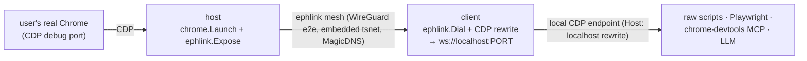

# ephlink

**Ephemeral, authenticated, peer-to-peer links between machines** — a small, protocol-agnostic Go library that moves raw TCP bytes between a local service on one machine and a named peer on another, over a Tailscale mesh (embedded `tsnet`), with single-use auto-expiring credentials. Expose a local port from machine A, consume it as a local port on machine B, and have the link tear itself down when you're done.

```go
import "github.com/dostarora97/ephlink"

node, _ := ephlink.Join(ctx, ephlink.Config{Hostname: "myhost", AuthKey: key})
defer node.Close()                        // ephemeral: auto-deregisters from the mesh
node.Expose("127.0.0.1:9222", 9222)       // publish a local service on the mesh
conn, _ := node.Dial(ctx, "peer:9222")    // reach a peer's service by name
```

It knows nothing about any particular protocol — the same library can carry CDP, SSH, a database port, or a dev server. See the [library reference](docs/LIBRARY.md).

## The flagship consumer: Chrome over CDP

The `cmd/` binaries use ephlink to **connect to a live user's real Chrome over the Chrome DevTools Protocol (CDP)** from another machine — passively ingest everything (network, console, events, storage, screencast) and actively drive it — re-presented as a **local CDP endpoint** so ANY CDP client (raw scripts, Playwright, the chrome-devtools MCP, an LLM) attaches unchanged.



The two binaries are a matched pair: **`host`** runs on the user's machine (shares their Chrome), **`client`** runs on the operator's machine (attaches to it).

## Repository map

Single Go module (`github.com/dostarora97/ephlink`): the library is the root package; the binaries live under `cmd/`.

| Path | What it is |
| --- | --- |
| `link.go`, `mint.go` | The `ephlink` library (root package). Symmetric API — `Join` / `Expose` / `Dial` / `Serve` / `Mint`. Knows nothing about CDP. |
| [`cmd/host`](cmd/host/README.md) | Runs on the user's Chrome machine: consent gate → launch Chrome → expose its CDP port on the mesh. |
| [`cmd/client`](cmd/client/README.md) | Runs on the operator's machine: dial the host, rewrite CDP, re-serve as `ws://localhost:PORT`. |
| `cmd/mint` | Operator-side minter for short-lived ephemeral mesh keys (thin CLI over `ephlink.Mint`). |
| `internal/chrome`, `internal/consent` | Support packages for the host (Chrome discovery/launch; the consent gate). |
| [`docs/LIBRARY.md`](docs/LIBRARY.md) | The `ephlink` library reference. |
| [`docs/DESIGN.md`](docs/DESIGN.md) | Architecture and the full design & decision history (trade-offs, rejected alternatives, evolution). |
| [`docs/TAILSCALE-SETUP.md`](docs/TAILSCALE-SETUP.md) | One-time tailnet setup (tags + OAuth client) needed for the mesh path. |

## Prerequisites

- **Go 1.26+**.
- **Google Chrome / Chromium / Edge** on the host machine (auto-detected on macOS/Linux/Windows; override with `--chrome-path`).
- For the **mesh path only:** a Tailscale account and a one-time setup — see [Tailscale setup](docs/TAILSCALE-SETUP.md). The loopback quickstart below needs none of this.
- Optional, for driving: Node + [Playwright](https://playwright.dev), or the chrome-devtools MCP.

## Build

One module, three binaries:

```sh
git clone https://github.com/dostarora97/ephlink && cd ephlink
go build ./...                       # library + all binaries
go build -o host   ./cmd/host       # or build them individually
go build -o client ./cmd/client
go build -o mint   ./cmd/mint
```

Or install a binary straight from the module path:

```sh
go install github.com/dostarora97/ephlink/cmd/host@latest
```

For release-style cross-platform archives, see [Releasing](#releasing).

## Quickstart A — loopback (no tailnet, one machine)

Prove the CDP seam end-to-end with zero Tailscale setup. `host` launches Chrome and exposes CDP only on loopback; point any client at it.

```sh
# terminal 1: launch Chrome with CDP on 127.0.0.1:9222, skip the mesh
./host --local-only --yes --cdp-port 9222

# terminal 2: attach any CDP client
#   Playwright:  const b = await chromium.connectOverCDP("http://127.0.0.1:9222")
#   or just:     curl -s http://127.0.0.1:9222/json/version
```

Use `--headless` to run Chrome without a window (smoke tests). Ctrl-C in terminal 1 kills Chrome and removes the temp profile.

## Quickstart B — over the mesh (two machines)

The real thing: `host` runs on the **user's** machine, `client` + the CDP clients on the **operator's**. Do the [one-time Tailscale setup](docs/TAILSCALE-SETUP.md) first (tags + OAuth client).

```sh
# ── operator: mint a short-lived ephemeral key ─────────────────────────────
export TS_OAUTH_CLIENT_SECRET=tskey-client-xxxxx     # or put it in .env (see .env.example)
HOSTKEY=$(./mint --expiry 30m)                       # defaults to --tag tag:ephlink-host

# ── user's machine: accept consent, launch Chrome, join the mesh ───────────
./host --authkey "$HOSTKEY" --operator "support"     # hostname defaults to cdp-host

# ── operator: dial the host by name, re-serve CDP locally ──────────────────
CLIENTKEY=$(./mint --expiry 30m)                     # the client joins the mesh too → its own key
./client --peer cdp-host:9222 --local-port 9333 --authkey "$CLIENTKEY"

# ── operator: attach any client to the local endpoint ──────────────────────
#   chromium.connectOverCDP("http://127.0.0.1:9333")
```

Both nodes join as **ephemeral** — they auto-deregister from the tailnet on exit. Quit / Ctrl-C on the host runs the full teardown: kill Chrome, delete the temp profile, drop the mesh node. See [`docs/DESIGN.md` → Teardown (D12)](docs/DESIGN.md) for the guarantees.

## CLI reference

**host** — runs on the user's machine, where Chrome is.

| Flag | Default | Meaning |
| --- | --- | --- |
| `--authkey` (`$TS_AUTHKEY`) | — | Ephemeral mesh key from `mint`. |
| `--operator` | `""` | Free-text label for who's connecting (shown in the consent prompt). |
| `--ttl` | `30 minutes` | Human-readable session duration (shown in consent). |
| `--cdp-port` | `9222` | Local CDP port for the launched Chrome. |
| `--hostname` | `cdp-host` | MagicDNS name for this node (the client dials this). |
| `--headless` | `false` | Run Chrome headless (smoke tests; real sessions are headful). |
| `--chrome-path` | auto | Override the Chrome executable. |
| `--active` | `true` | Allow the operator to actively drive, not just observe. |
| `--yes` | `false` | Skip the interactive consent prompt (supervised automation). |
| `--local-only` | `false` | Don't touch the mesh — loopback CDP only (Quickstart A). |

**mint** — operator side. `mint [--tag tag:ephlink-host] [--expiry 30m]`, reads `TS_OAUTH_CLIENT_SECRET` (or `.env`), prints a key.

**client** — operator side.

| Flag | Default | Meaning |
| --- | --- | --- |
| `--peer` | — | Host to reach, `MagicDNS-name:port` (e.g. `cdp-host:9222`). |
| `--local-port` | `0` (OS picks) | Local port to re-serve CDP on. |
| `--hostname` | `cdp-client` | MagicDNS name for the client node. |
| `--authkey` (`$TS_AUTHKEY`) | — | Ephemeral mesh key for the client. |

## Configuration

The minter reads the Tailscale OAuth client secret from the environment or a `.env` file (searched in the cwd and up to three parents). Copy [`.env.example`](.env.example) to `.env` and fill it in; `.env` is gitignored. The secret stays operator-side and is never handed to a joining node — nodes receive only the short-expiry key `mint` produces.

## Releasing

Cross-platform binaries are built with [GoReleaser](https://goreleaser.com) (config in [`.goreleaser.yaml`](.goreleaser.yaml)).

```sh
# local snapshot (all platforms, no publish):
goreleaser release --snapshot --clean
# single local build for the current platform:
goreleaser build --snapshot --clean --single-target
```

Pushing a `vX.Y.Z` tag triggers the [release workflow](.github/workflows/release.yml), which runs GoReleaser and publishes the archives + checksums to a GitHub Release. You can also publish from your machine with `GITHUB_TOKEN` set: `goreleaser release --clean`. Binaries are currently **unsigned** (see [`docs/DESIGN.md` → Packaging/signing (D11)](docs/DESIGN.md)); the signing config is present but disabled until certs exist.

## Troubleshooting

- **"no Chrome/Chromium/Edge found"** — install a Chromium-family browser or pass `--chrome-path`.
- **"the CDP port … is already in use"** — `host` launches its *own* Chrome with the debug port; it does not attach to a Chrome that's already running. That message means something (often your own running Chrome) already holds the port. Quit it or pass a free `--cdp-port`. Note: you cannot enable remote debugging on an already-running Chrome via `chrome://inspect/#remote-debugging` — that page only forwards to targets that already expose a port; it does not turn one on for the browser you're viewing. (See [`docs/DESIGN.md` → Chrome profile (D4)](docs/DESIGN.md).)
- **Mesh join fails / hangs** — the key is expired or wrong (they're short-lived by design; mint a fresh one), or the [Tailscale tags/OAuth setup](docs/TAILSCALE-SETUP.md) isn't in place.
- **Client can't attach to the local endpoint** — confirm `client` printed its local port and that `--peer` matches the host's `--hostname` and `--cdp-port`.
- **`goreleaser` publish 401** — the token/host must match your GitHub instance; on GitHub Enterprise, set the API/upload URLs in `github_urls`. Actions may be disabled on some hosts.

## Security posture

Modern sane defaults, no bespoke crypto: WireGuard end-to-end (no third party reads the stream), ephemeral single-use tagged keys, temp Chrome profile by default, explicit consent before anything is exposed, full idempotent teardown. Some hardening (a live "connected" indicator, binary signing, audit logging, a provisioning endpoint) is deferred and gates broad / untrusted-user distribution — the reasoning and the full deferred list are in [`docs/DESIGN.md`](docs/DESIGN.md).

## License

[MIT](LICENSE).
